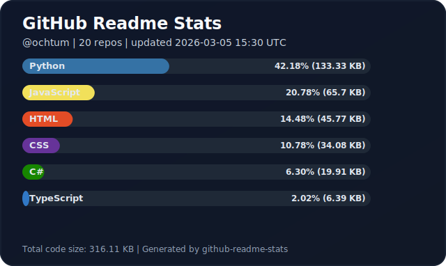

<p align="left">
  <a href="README_en.md"></a>
  <a href="README.md"></a>
</p>

# GitHubReadMeStats (.NET 10 / C#)

This is a CLI that uses the GitHub GraphQL API to generate SVGs for profile READMEs.  
In addition to `top-languages.svg`, it can also output `github-stats.svg`, `stats.svg`, `public-repo-totals.svg`, and `pins/*.svg`.

## What This Repository Is For

This repository is an SVG generator tool for READMEs.  
For real-world usage, we recommend calling this tool from GitHub Actions in each user's profile repository (`<user>/<user>`).

### What You Can Do

- Aggregate language usage across owned repositories and generate `top-languages.svg`
- Aggregate Stars/Commits/PRs/Issues/Rank and generate `github-stats.svg`
- Aggregate contribution trends + Public/Private/Forked repo counts and generate `stats.svg`
- Aggregate Public repo Traffic/Fork/Watch/Star and generate `public-repo-totals.svg`
- Generate per-repository cards as `pins/<owner>-<repo>.svg`
- Configure language colors, language icons, and repository icons via `cards-config.json`
- Accumulate daily Traffic data for each Public repository into `output/traffic-history.json` to support cumulative display
- Automatically update a specific section in README (`--update-readme`)

### Tech Stack

- C# / .NET 10 (`net10.0`)
- GitHub GraphQL API + GitHub REST API (Traffic)

### SVG Outputs Explained

Theme gallery: [theme-sample.md](./theme-sample.md)

- `top-languages.svg`: A card that visualizes top N language usage percentages for repositories owned by the user.
- `github-stats.svg`: A summary card showing Stars / Commits (last year) / PRs / Issues / Contributed repositories and rank.
- `stats.svg`: A profile stats card showing contribution trend graphs and profile metrics such as Public/Private/Forked repository counts.
- `public-repo-totals.svg`: A card for Public repositories that shows Traffic totals (Git Clones / Unique Cloners / Total Views / Unique Visitors) and Fork/Watch/Starred totals.
- `pins/*.svg`: Per-repository cards for repos specified in `cards-config.json` under `repositories`. Displays description, language, stars/forks, and Traffic (when available).

### Requirements

- .NET SDK 10
- GitHub Personal Access Token (`GH_TOKEN` or `GITHUB_TOKEN` environment variable)

### Recommended Token Permissions

- Classic PAT: Grant `repo` for easier handling including private repositories.
- Fine-grained PAT: Grant `Contents: Read` to required repositories for the target user.
- If you want to show traffic metrics on repository cards, Fine-grained PAT also requires `Administration: Read` (GitHub Traffic API requirement).
- Include all repositories where traffic metrics are needed in Fine-grained PAT `Repository access` (all target repos in `cards-config.json`).
- If you aggregate or generate cards for private repositories, the token must have access to those private repositories.


## Prerequisites

Before running this in a profile repository, prepare the following.

1. Create a GitHub PAT

- Open GitHub top-right avatar -> `Settings` -> `Developer settings` -> `Personal access tokens`
- For `Tokens (classic)`, use `Generate new token (classic)` and grant `repo`
- If using `Fine-grained tokens`, grant `Contents: Read` to target repositories
- If using traffic metrics, also grant `Administration: Read`
- Save the issued token string when shown (it cannot be displayed again)

2. Configure Secrets in your profile repository (`<user>/<user>`)

- `Settings` -> `Secrets and variables` -> `Actions` -> `New repository secret`
- `GH_TOKEN`: Set the PAT created in step 1
- `EXCLUDED_LANGUAGES` (optional): Comma-separated languages to exclude  
  Example: `html,css,dockerfile,jupyter notebook`

3. Additional requirements when checking out a private tool repository

- If your workflow `actions/checkout` uses `repository: ochtum/GitHubReadmeStats`, `GH_TOKEN` must be able to read that repository
- In the workflow, set `token: ${{ secrets.GH_TOKEN }}` (included as a comment in the README sample)


## Quick Start (local)

### 1. Install .NET SDK 10

- Running `dotnet` requires the .NET SDK.
- Windows:
  - `winget install --id Microsoft.DotNet.SDK.10 --exact`
  - Or use the official installer: https://dotnet.microsoft.com/download/dotnet/10.0
- Linux / WSL:
  - Official instructions: https://learn.microsoft.com/dotnet/core/install/linux
- Verify installation: run `dotnet --version` and confirm it shows `10.x`

### Linux / WSL (bash)

```bash
export GH_TOKEN=ghp_xxxxxxxxxxxxxxxxxxxx

dotnet run --project src/GitHubReadMeStats.Cli/GitHubReadMeStats.Cli.csproj -- \
  --output output \
  --exclude-languages "html,css,dockerfile" \
  --top 6 \
  --cards-config cards-config.json
```

### Windows (PowerShell)

```powershell
$env:GH_TOKEN="ghp_xxxxxxxxxxxxxxxxxxxx"

dotnet run --project src/GitHubReadMeStats.Cli/GitHubReadMeStats.Cli.csproj -- `
  --output output `
  --exclude-languages "html,css,dockerfile" `
  --top 6 `
  --cards-config cards-config.json
```

### cards-config.json

When `--cards-config` is specified, `github-stats.svg`, `stats.svg`, `public-repo-totals.svg`, and `pins/*.svg` are generated.

```json
{
  "username": "ochtum",
  "theme": "indigo-night",
  "displayTimeZone": "Asia/Tokyo",
  "displayTimeZoneLabel": "JST",
  "languageColors": {
    "JavaScript": "#f1e05a",
    "TypeScript": "oklch(0.72 0.16 248)"
  },
  "languageIcons": {
    "JavaScript": "./assets/icons/javascript.svg",
    "TypeScript": "./assets/icons/typescript.svg"
  },
  "repositories": [
    "ochtum/CaptureScreenMCP",
    {
      "owner": "ochtum",
      "name": "SlackEmojiBookmaker",
      "languageColor": "#ffd54f",
      "languageIcon": "./assets/icons/js-alt.png",
      "icon": "./assets/icons/slack-emoji.png"
    },
    "microsoft/vscode-generator-code",
    {
      "owner": "tldraw",
      "name": "tldraw",
      "icon": "./assets/icons/tldraw.svg"
    }
  ]
}
```

Notes:

- `languageColors`: Color override per language name (applied when matching `PrimaryLanguage`)
- `repositories[].languageColor`: Per-repository color override (used when `languageColors` does not apply)
- `languageIcons`: Icon override per language name (applied when matching `PrimaryLanguage`)
- `repositories[].languageIcon`: Per-repository language icon override (used when `languageIcons` does not apply)
- `theme`: Built-in preset name for all cards. Supported values: `indigo-night` (default), `cobalt`, `ocean`, `teal`, `emerald`, `amber`, `coral`, `violet`, `graphite`, `sakura`, `rose-petal`, `lavender-mist`, `peach-cream`, `mint-bloom`, `neon-night`. `neon-night` reproduces the design used before `mainColor` was introduced
- `mainColor`: Global main color for all cards (hex / `oklch(...)`). If `theme` is also specified, `theme` takes precedence. Backgrounds, borders, text, and icon/label colors are auto-adjusted (language colors are unchanged)
- `repositories[].icon`: Repository icon setting (supports paths relative to `cards-config.json`, absolute paths, `https://...`, and `data:image/...`)
- `displayTimeZone`: Time zone used for `updated` timestamps (defaults to `UTC`)
- `displayTimeZoneLabel`: Display label (e.g., `JST`; when omitted, auto-determined as `UTC` / `UTC+09:00` / `Asia/Tokyo`, etc.)

### CLI Options

- `--github-token`, `-t`: GitHub token
- `--output`, `-o`: Output file path or output directory for language card SVG (default: `output` -> `output/top-languages.svg`). When `--cards-config` is enabled, stats/pin/public cards are generated under this parent directory
- `--exclude-languages`, `-x`: CSV of excluded languages
- `--top`: Number of top languages to show (`1..20`)
- `--include-forks`: Include fork repositories in aggregation
- `--include-archived`: Include archived repositories in aggregation
- `--update-readme`: Path of README to update
- `--image-path`: Image path embedded in README
- `--start-marker`: README section start marker
- `--end-marker`: README section end marker
- `--cards-config`: JSON config for stats/pin card generation
- `--cards-output-dir`: Compatibility override option. If omitted, parent directory of `--output` is used

## Setup for Profile Repository

Target repository is `<user>/<user>` profile repository.

1. Create `.github/workflows/update-profile-readme-stats.yml`

```yaml
name: update-profile-readme-stats

on:
  schedule:
    - cron: "0 0 * * 1"
  workflow_dispatch:

permissions:
  contents: write

jobs:
  update:
    runs-on: ubuntu-latest
    steps:
      - name: Checkout profile repository
        uses: actions/checkout@v4

      - name: Checkout stats generator repository
        uses: actions/checkout@v4
        with:
          repository: ochtum/GitHubReadmeStats
          ref: main
          path: tools/github-readme-stats
          # Required only when the tool repo is private
          # token: ${{ secrets.GH_TOKEN }}

      - name: Setup .NET 10
        uses: actions/setup-dotnet@v4
        with:
          dotnet-version: 10.0.x

      - name: Generate cards
        env:
          GH_TOKEN: ${{ secrets.GH_TOKEN }}
          EXCLUDED_LANGUAGES: ${{ secrets.EXCLUDED_LANGUAGES }}
        run: |
          mkdir -p output output/pins
          dotnet run --project tools/github-readme-stats/src/GitHubReadMeStats.Cli/GitHubReadMeStats.Cli.csproj --configuration Release -- \
            --output output \
            --exclude-languages "${EXCLUDED_LANGUAGES}" \
            --top 6 \
            --cards-config cards-config.json

      - name: Commit and push if changed
        run: |
          git config user.name "github-actions[bot]"
          git config user.email "github-actions[bot]@users.noreply.github.com"
          git add README.md cards-config.json output/top-languages.svg output/github-stats.svg output/stats.svg output/public-repo-totals.svg output/traffic-history.json output/pins/*.svg
          if git diff --cached --quiet; then
            echo "No changes to commit"
            exit 0
          fi
          git commit -m "chore: update profile readme stats"
          git push
```

2. Create `cards-config.json` at repository root

```json
{
  "username": "your-github-id",
  "theme": "indigo-night",
  "repositories": [
    "your-github-id/your-repo-1",
    "your-github-id/your-repo-2",
    "microsoft/vscode-generator-code"
  ]
}
```

3. Configure Secrets as described in the prerequisites section

- `GH_TOKEN`: PAT used for GraphQL access
- `EXCLUDED_LANGUAGES`: Optional (example: `html,css,dockerfile`)

4. Run `Actions -> update-profile-readme-stats -> Run workflow`

## README.md Embedding Example

In `<user>/<user>/README.md`, you can display generated cards like this:

```md
## Weekly Update

<p align="center">
  <a href="https://github.com/ochtum/GitHubReadmeStats">
    
  </a>
</p>

## GitHub Stats


## My Projects

<a href="https://github.com/your-github-id/your-repo-1">
  
</a>
<a href="https://github.com/microsoft/vscode-generator-code">
  
</a>
```

`pins` file names use the `owner-repo.svg` format.  
Example: `microsoft/vscode-generator-code` -> `./output/pins/microsoft-vscode-generator-code.svg`

To preserve traffic accumulation, include `output/traffic-history.json` in the workflow commit targets.

## Limitations

- `top-languages` is aggregated from repositories owned by the executing token's `viewer`.
- `pins` fetches each `owner/repo` specified in `cards-config.json` individually.
- Private repositories without access permission cannot be fetched.
- Traffic API only provides daily data for the last 14 days. By accumulating daily data in `output/traffic-history.json`, cards can display totals from the data collection start date onward.
- There is no API that can strictly reconstruct all-time unique cloners/visitors, so cumulative display is the sum of daily uniques.

## If You Want Scheduled Execution

- The workflow sample in the setup section already includes `schedule`.
- To change run time, edit only the `cron` value (UTC-based).
- Example: To run every Monday at 09:00 JST, use `0 0 * * 1` (UTC).
- `schedule` runs against the latest commit on the default branch.
- Minimum interval for `schedule` is 5 minutes.
- Under high GitHub load, `schedule` runs may be delayed.
- In public repositories, schedule may be auto-disabled after 60 days of no repository activity. If disabled, re-enable it from the Actions page.

```yaml
on:
  schedule:
    - cron: "0 0 * * 1" # Change this value
  workflow_dispatch:
```

Common examples:

- Every day at 09:00 JST: `0 0 * * *`
- Every Monday at 09:00 JST: `0 0 * * 1`
- On the 1st of every month at 09:00 JST: `0 0 1 * *`

## References

- https://zenn.dev/chot/articles/30b08c452795eb
- https://github.com/4okimi7uki/repo-spector

## License

- This project is distributed under the [MIT License](./LICENSE).
- For third-party attribution and reused-code notices, see [THIRD_PARTY_NOTICES.md](./THIRD_PARTY_NOTICES.md).
