# Theme Samples

`theme-sample/<theme>/` に生成した SVG サンプルの一覧です。

## indigo-night

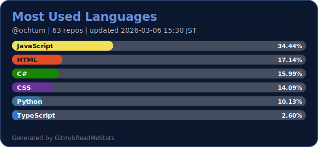
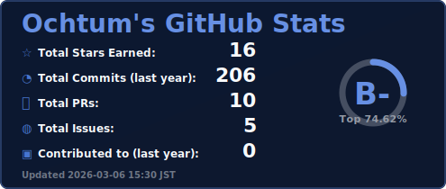
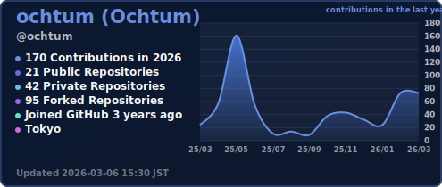
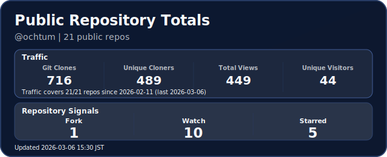
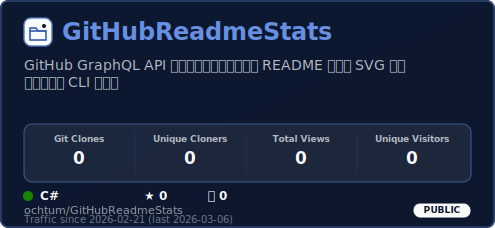

## cobalt

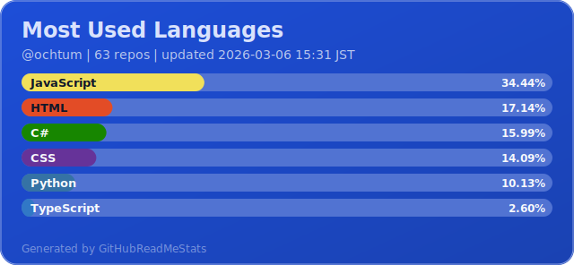
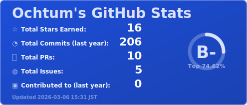
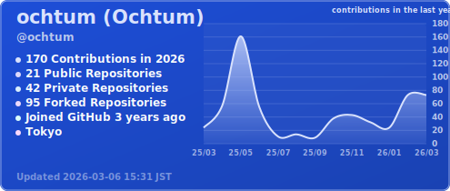
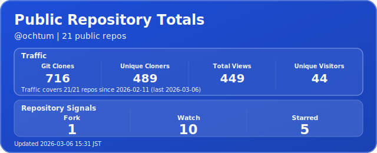
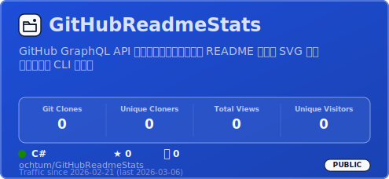

## ocean

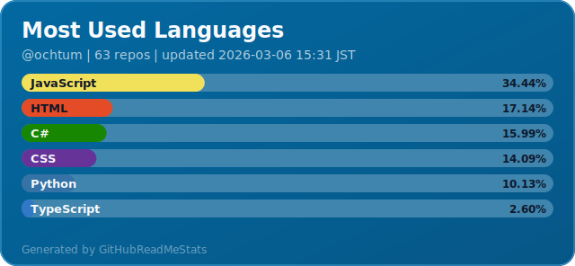
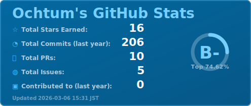
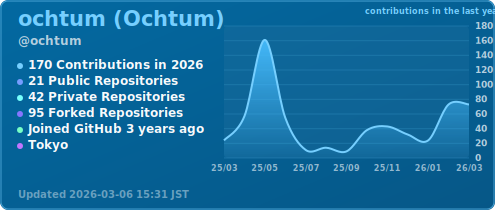
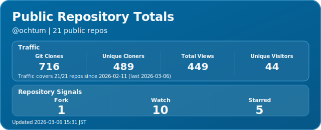
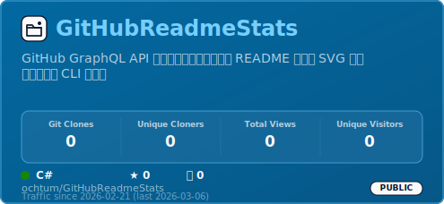

## teal

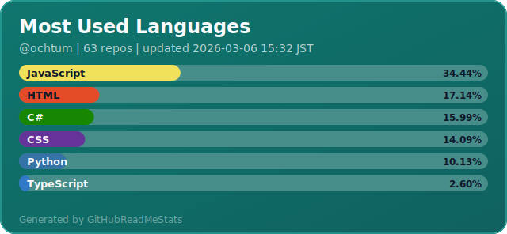
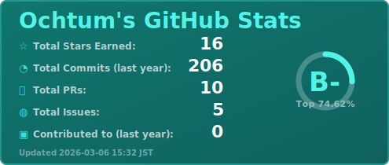
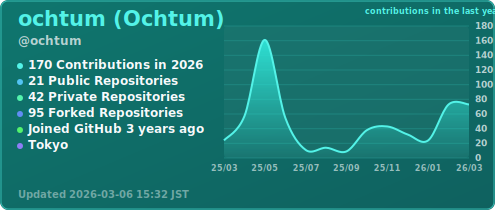
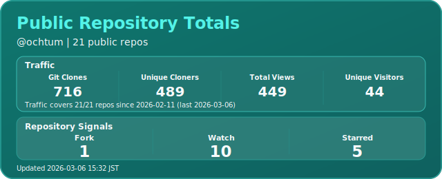
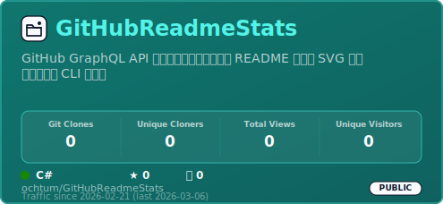

## emerald

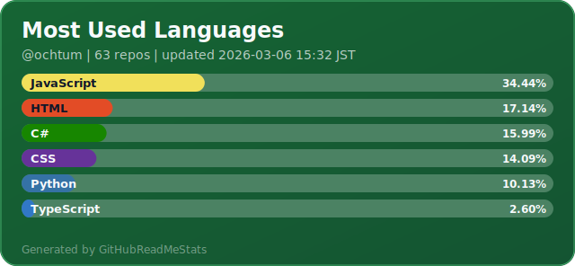
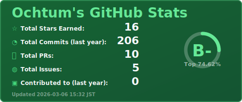
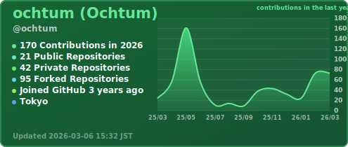
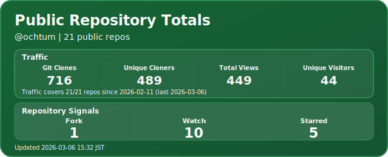
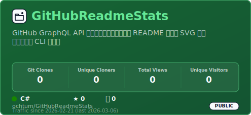

## amber

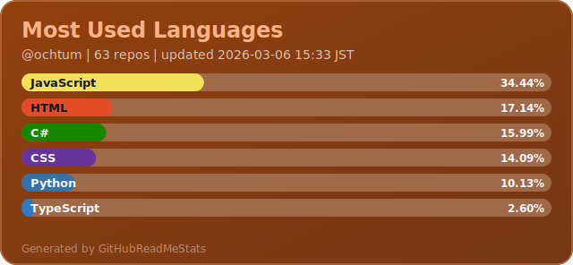
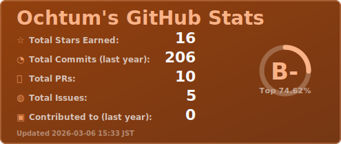
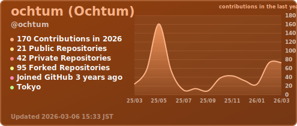
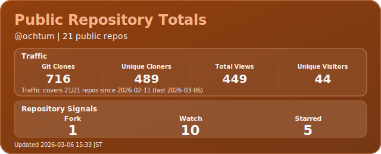
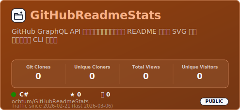

## coral

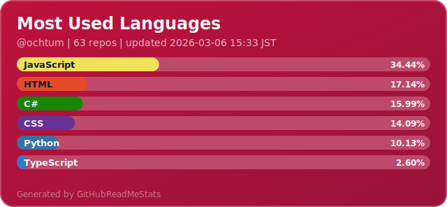
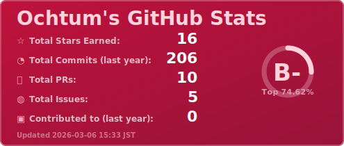
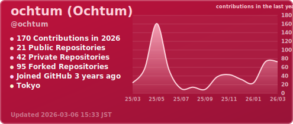
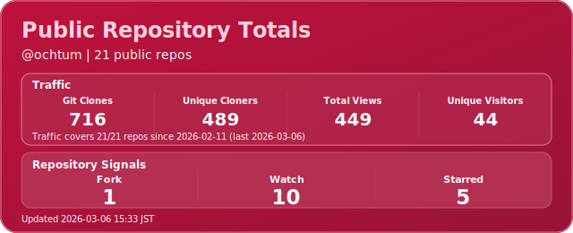
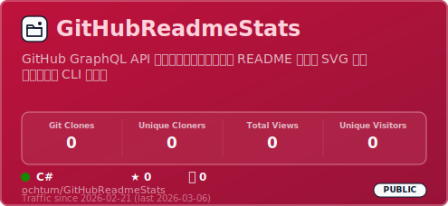

## violet

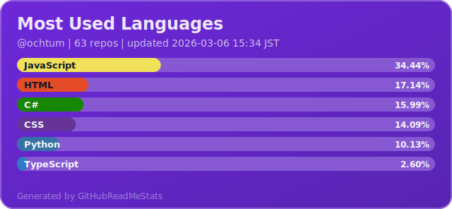
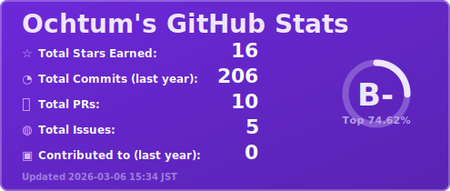
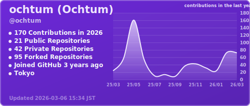
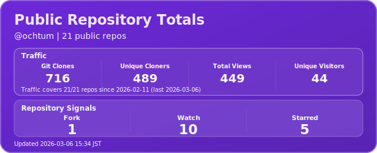
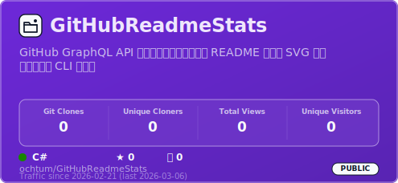

## graphite

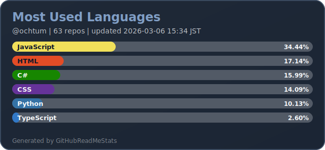
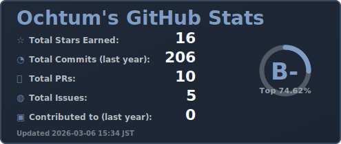
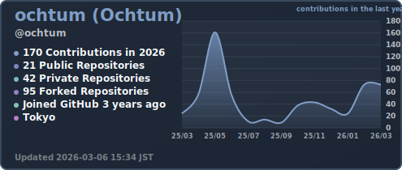
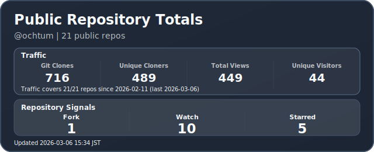
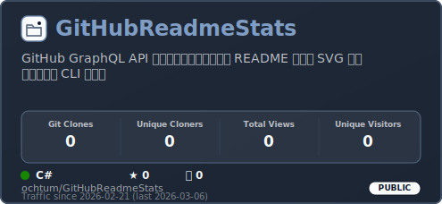

## sakura

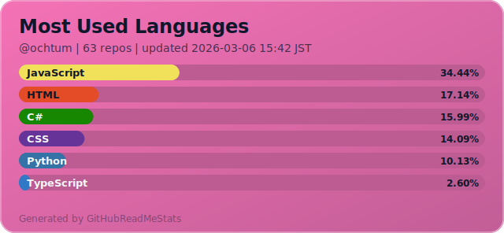
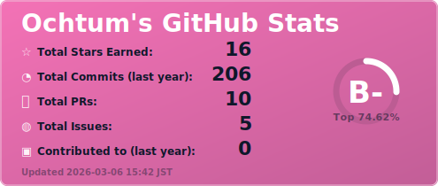
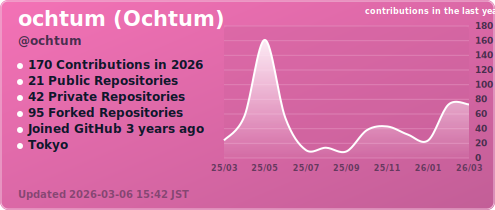
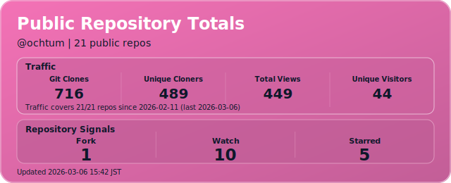
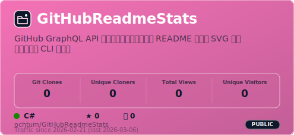

## rose-petal

## lavender-mist

## peach-cream

## mint-bloom

## neon-night

